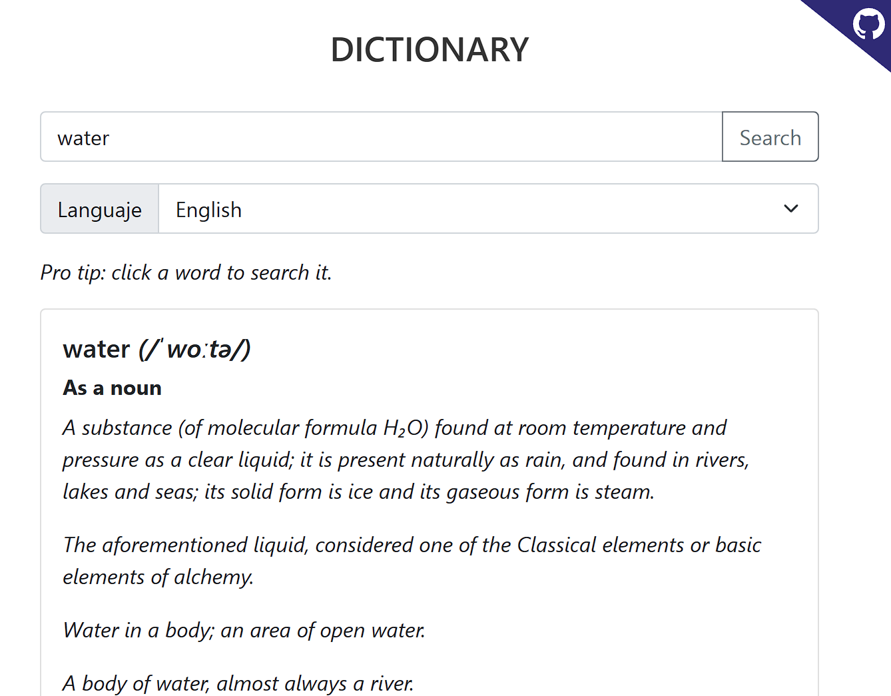

# Dictionary

Web dictionary for Spanish and English languages, installable as [PWA](https://developer.mozilla.org/en-US/docs/Web/Progressive_web_apps).

[https://fs-frost.github.io/dictionary](https://fs-frost.github.io/dictionary)



## Built with

-   [Svelte](https://svelte.dev/)
-   [TypeScript](https://www.typescriptlang.org/)
-   [Rollup](https://rollupjs.org/)
-   [Free Dictionary API](https://dictionaryapi.dev)

## Run locally

```shell
bun install
bun run dev
```

Go to http://localhost:5000.
