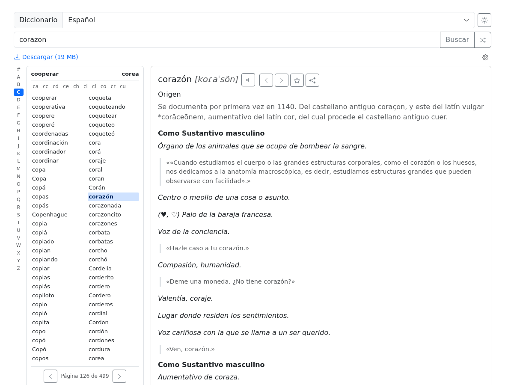

# Dictionary

Web dictionary for Spanish and English, installable as a [PWA](https://developer.mozilla.org/en-US/docs/Web/Progressive_web_apps) — and it **works with no connection at all**.

[https://fs-frost.github.io/dictionary](https://fs-frost.github.io/dictionary)



## Offline first

The 30,000 most frequent words of each language ship with the app: definitions,
IPA transcriptions, etymologies, usage examples and synonyms. Looking a word up
normally never touches the network.

Press **Download for offline use** and the whole language is stored in your
browser (19 MB for Spanish, 36 MB for English). After that the dictionary works
on a plane, on the underground, or with the Wi-Fi off — including words you have
never searched before.

When a word is not in the bundled dataset, the app falls back to online sources.
None of them requires an API key.

| Language | Order of lookup |
|---|---|
| Spanish | bundled dataset → [rae-api.com](https://rae-api.com/) → [freedictionaryapi.com](https://freedictionaryapi.com/) |
| English | bundled dataset → [dictionaryapi.dev](https://dictionaryapi.dev/) → [freedictionaryapi.com](https://freedictionaryapi.com/) |

Spanish queries the RAE first because it defines words *in Spanish*; the
Wiktionary-backed APIs serve English glosses and would answer `agua` with
"water".

## Built with

-   [Svelte 5](https://svelte.dev/) and [SvelteKit 2](https://svelte.dev/docs/kit) with [adapter-static](https://svelte.dev/docs/kit/adapter-static)
-   [TypeScript](https://www.typescriptlang.org/) and [Zod](https://zod.dev/)
-   [Vite](https://vite.dev/) and [Bun](https://bun.sh/)
-   [Vitest](https://vitest.dev/) and [Playwright](https://playwright.dev/)
-   Dictionary data from [Wiktionary](https://www.wiktionary.org/) via [kaikki.org](https://kaikki.org/) (wiktextract)

## Run locally

```shell
bun install
bun run dev
```

Go to http://localhost:5000.

## Commands

```shell
bun run check        # type and template checking
bun run test         # unit tests + dataset integrity
bun run test:e2e     # end-to-end, including a real offline run
bun run build        # static build into build/
bun run preview      # serve the build on http://localhost:5000
```

The end-to-end tests need a Chromium (`bunx playwright install chromium`). If you
already have one, `CHROMIUM_PATH=/path/to/chrome bun run test:e2e` skips the
download.

## Regenerating the dataset

`static/data/` is generated and committed. To rebuild it, download a
[wiktextract dump](https://kaikki.org/) and a frequency list from
[hermitdave/FrequencyWords](https://github.com/hermitdave/FrequencyWords):

```shell
bun run dataset:es --input es.jsonl.gz --freq es_50k.txt
bun run dataset:en --input en.jsonl.gz --freq en_50k.txt
```

Use the `eswiktionary/Español` export for Spanish — the `dictionary/Spanish` one
contains Spanish words glossed in English.

## Deploy

Pushing to `master` triggers [the GitHub Actions workflow](.github/workflows/main.yml),
which type-checks, runs both test suites, builds the site, rewrites the base tag
to `/dictionary/` and publishes `build/` to the `gh-pages` branch.

## Licence and attribution

Dictionary content comes from [Wiktionary](https://www.wiktionary.org/) and is
licensed under [CC BY-SA 4.0](https://creativecommons.org/licenses/by-sa/4.0/).
Spanish definitions fetched online come from the
[Diccionario de la lengua española](https://dle.rae.es/) through the unofficial
[rae-api.com](https://rae-api.com/). Icons are from
[Bootstrap Icons](https://icons.getbootstrap.com/) (MIT).
