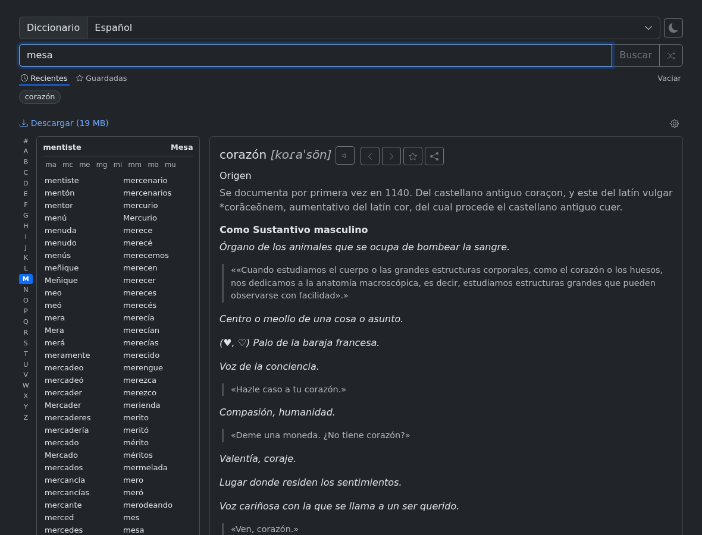
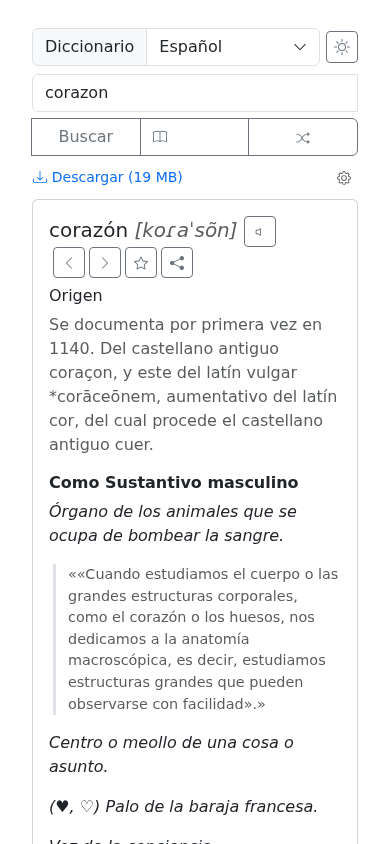
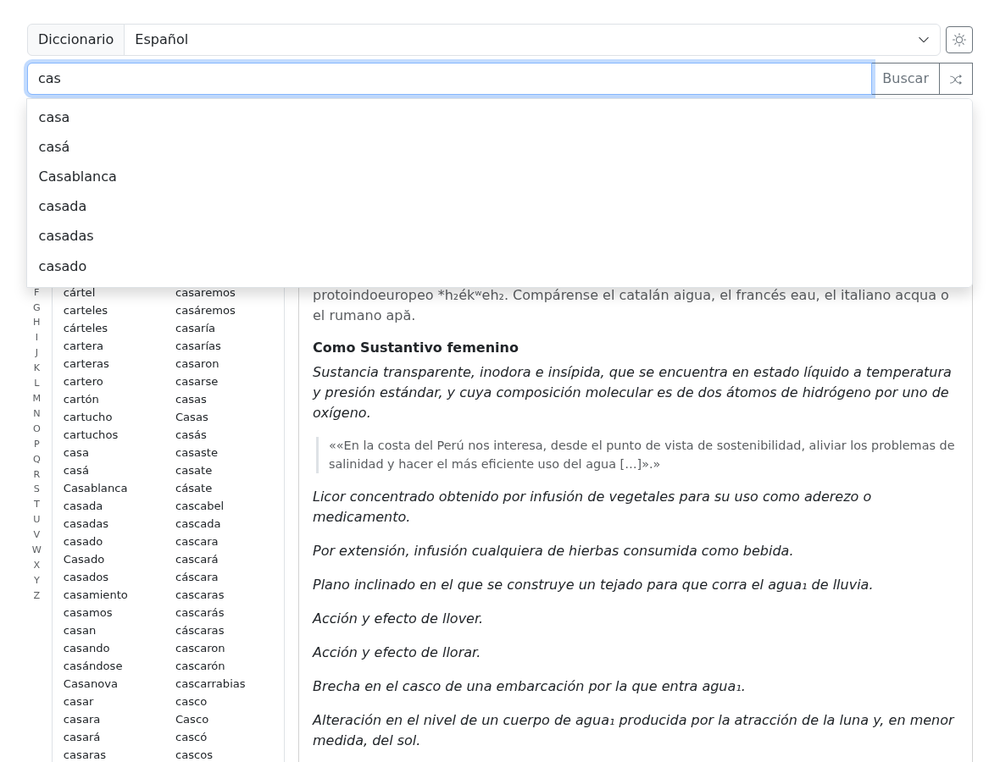
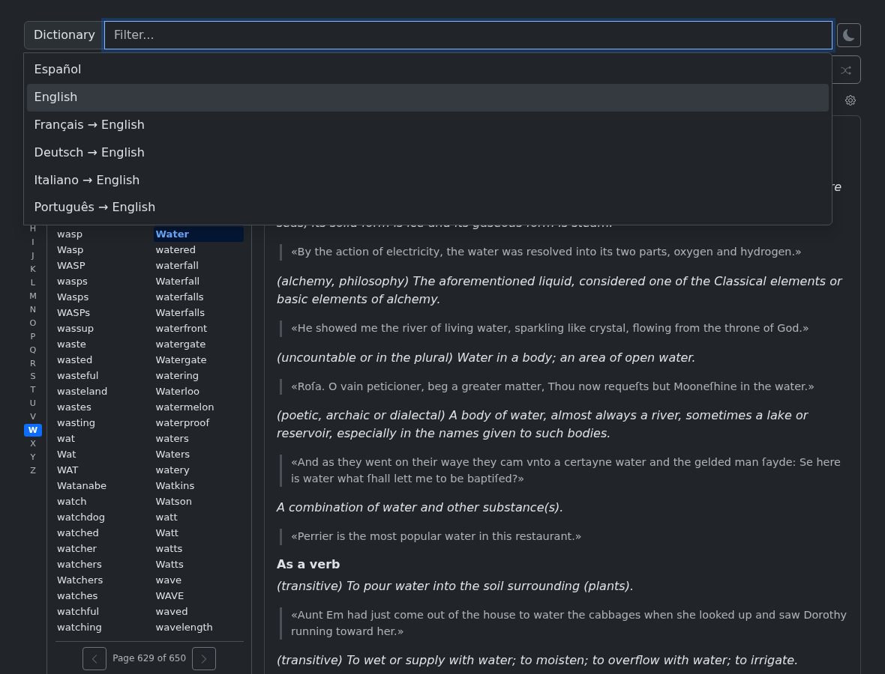

# Dictionary

Web dictionary in six languages, installable as a [PWA](https://developer.mozilla.org/en-US/docs/Web/Progressive_web_apps) — and it **works with no connection at all**.

[https://fs-frost.github.io/dictionary](https://fs-frost.github.io/dictionary)


## The index is always open

The word list sits next to the entry, the way the spine of a dictionary sits next
to the page you are reading. The word you are looking at is marked in it, typing
moves it before you even press Enter, and the arrow keys walk to the word next
door — which is how you end up reading things you were not looking for.



The letter tabs go down the side, with a second level inside the current letter
(`ca ce ci co cu`), because on their own A–Z is a jump of dozens of pages.

On a phone the same thing holds: the search box and the dictionary picker stay
where they are, and the index folds away behind its own button.



## It starts somewhere

There is a **word of the day** — the same on every device, worked out from the
date, no account and no server — and a shuffle button that opens the dictionary
at random, the way you would with a paper one.



Typing suggests words as you go, everything you look up is kept in **Recent**,
and the star keeps a word in **Saved**. All of it lives in your browser; none of
it leaves your device.

When a word is missing from the dictionary you are in, the app tells you if it is
in one of the others and takes you there in one click.

## Six dictionaries

| Dictionary | Words | Definitions | Size |
|---|---|---|---|
| Español | Spanish | **Spanish** | 19 MB |
| English | English | English | 36 MB |
| Français → English | French | English | 12 MB |
| Deutsch → English | German | English | 13 MB |
| Italiano → English | Italian | English | 10 MB |
| Português → English | Portuguese | English | 10 MB |

The four bilingual ones are named with an arrow because that is what they are:
their definitions are written **in English**. That distinction is the whole
reason they sit next to `Español` instead of replacing it — a Spanish dictionary
glossed in English answers `agua` with "water", which is not a Spanish
dictionary.

They are also **offline only**: no public API returns French glossed in English,
so there is nothing to fall back to, and the app says so instead of pretending.



## Offline first

The ~30,000 most frequent words of each language ship with the app: definitions,
IPA transcriptions, and — for Spanish and English — etymologies, usage examples
and synonyms. Looking a word up normally never touches the network.

Press **Download for offline use** and the whole dictionary is stored in your
browser. After that it works on a plane, on the underground, or with the Wi-Fi
off — including words you have never searched before.

The app asks the browser to keep that download **permanently**: by default
anything a website stores can be thrown away to free disk space, which for an
offline-first dictionary is the worst possible failure. The dictionary manager
shows whether the browser granted it.

Downloads can be cancelled halfway, and a downloaded language can be removed
again from the **dictionary manager** (the gear next to the download button),
which also shows both languages at once, the connection status and how much
space the site is using.

When a word is not in the bundled dataset, Spanish and English fall back to
online sources. None of them requires an API key.

| Dictionary | Order of lookup |
|---|---|
| Español | bundled dataset → [rae-api.com](https://rae-api.com/) → [freedictionaryapi.com](https://freedictionaryapi.com/) |
| English | bundled dataset → [dictionaryapi.dev](https://dictionaryapi.dev/) → [freedictionaryapi.com](https://freedictionaryapi.com/) |
| the bilingual ones | bundled dataset only |

Spanish queries the RAE first because it defines words *in Spanish*; the
Wiktionary-backed APIs serve English glosses and would answer `agua` with
"water".

## Light and dark

The theme follows your system by default. The button in the header cycles
light → dark → system, tells you which one is active and confirms each change
with a toast. The choice is remembered, and it is applied before the first paint
so dark mode never flashes white on load.

## Built with

-   [Svelte 5](https://svelte.dev/) and [SvelteKit 2](https://svelte.dev/docs/kit) with [adapter-static](https://svelte.dev/docs/kit/adapter-static)
-   [Bootstrap 5.3](https://getbootstrap.com/), self-hosted — no CDN
-   [TypeScript](https://www.typescriptlang.org/) and [Zod](https://zod.dev/)
-   [Vite](https://vite.dev/) and [Bun](https://bun.sh/)
-   [Vitest](https://vitest.dev/) and [Playwright](https://playwright.dev/)
-   Dictionary data from [Wiktionary](https://www.wiktionary.org/) via [kaikki.org](https://kaikki.org/) (wiktextract)

## Run locally

```shell
bun install
bun run dev
```

Go to http://localhost:5000.

## Keyboard

| Key | |
|---|---|
| `/` | focus the search box |
| `←` `→` | previous / next word |
| `↑` `↓` `Enter` | pick a suggestion |

## Commands

```shell
bun run check        # type and template checking
bun run test         # unit tests + dataset integrity
bun run test:e2e     # end-to-end, including a real offline run
bun run build        # static build into build/
bun run preview      # serve the build on http://localhost:5000
```

The end-to-end tests need a Chromium (`bunx playwright install chromium`). If you
already have one, `CHROMIUM_PATH=/path/to/chrome bun run test:e2e` skips the
download.

## Regenerating the dataset

`static/data/` is generated and committed. To rebuild it, download a
[wiktextract dump](https://kaikki.org/) and a frequency list from
[hermitdave/FrequencyWords](https://github.com/hermitdave/FrequencyWords):

```shell
bun run dataset:es --input es.jsonl.gz --freq es_50k.txt
bun run dataset:en --input en.jsonl.gz --freq en_50k.txt
```

Use the `eswiktionary/Español` export for Spanish — the `dictionary/Spanish` one
contains Spanish words glossed in English.

The bilingual dictionaries come from
[tdulcet/compact-dictionaries](https://github.com/tdulcet/compact-dictionaries)
(JSON Lines, not compressed):

```shell
bun run scripts/build-dataset.ts --format compact \
    --lang fr --gloss en --name "Français" \
    --input dictionary-fr.jsonl --freq fr_50k.txt
```

## Deploy

Pushing to `master` triggers [the GitHub Actions workflow](.github/workflows/main.yml),
which type-checks, runs both test suites, builds the site, rewrites the base tag
to `/dictionary/` and publishes `build/` to the `gh-pages` branch.

## Licence and attribution

Dictionary content comes from [Wiktionary](https://www.wiktionary.org/) and is
licensed under [CC BY-SA 4.0](https://creativecommons.org/licenses/by-sa/4.0/).
The bilingual dictionaries are built from
[tdulcet/compact-dictionaries](https://github.com/tdulcet/compact-dictionaries),
also Wiktionary-derived and licensed CC BY-SA / GFDL.
Spanish definitions fetched online come from the
[Diccionario de la lengua española](https://dle.rae.es/) through the unofficial
[rae-api.com](https://rae-api.com/). Icons are from
[Bootstrap Icons](https://icons.getbootstrap.com/) (MIT), inlined as SVG.
